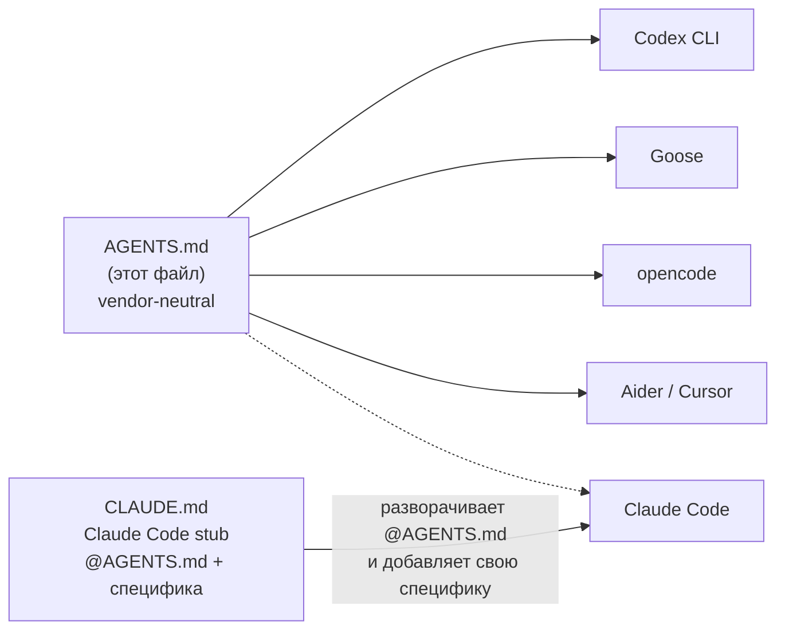
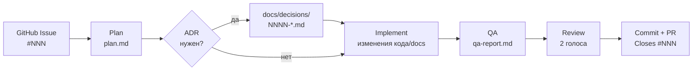

# AGENTS.md — claude-mini

> Этот файл читается любым AI-агентом: Claude Code, Codex CLI, Goose, opencode, Aider, Cursor и другими.
> Он содержит только то, что работает независимо от инструмента.
> Claude Code-специфика (slash-команды, subagents, advisor) — в `CLAUDE.md`.

## Кто читает что



Если твой инструмент не понимает `@`-импорты — прочти этот файл напрямую.
Если понимает — `CLAUDE.md` уже включает его содержимое автоматически.

---

## Где живёт знание (Source of truth)

| Что | Где |
|---|---|
| Задачи, спринты | GitHub Issues + Projects v2 |
| Архитектурные решения | `docs/decisions/` (MADR 4.0) |
| Доменная модель | `docs/domain/` |
| Системная архитектура | `docs/architecture/` |
| Принципы | `docs/principles.md` |
| Анти-паттерны (ловушки LLM) | `docs/anti-patterns.md` |
| Процедуры | `docs/runbooks/` |

Голова оператора, память LLM, история чата — **не** источники истины.
Если знание не зафиксировано в репо — оно потеряется.

---

## Структура репо

```
docs/
├── architecture/     — как устроено целиком
├── decisions/        — ADR: почему принято то или иное решение
├── domain/           — термины и границы контекстов
├── principles.md     — девять принципов (контракт)
├── anti-patterns.md  — ловушки, в которые LLM падает регулярно
├── runbooks/         — пошаговые сценарии
└── metrics/          — health-отчёты

bootstrap/
├── agents/           — read-only AI-критики
├── commands/         — slash-команды (Claude Code)
├── hooks/            — commit-governance + форматирование
├── scripts/          — утилиты
├── templates/        — шаблоны для новых проектов
└── universal-setup.sh — идемпотентный установщик
```

---

## Как запустить / проверить

```bash
# Проверить что установлено (dry-run)
./bootstrap/universal-setup.sh --check

# Установить / обновить на этой машине
./bootstrap/universal-setup.sh --install

# Установить pipeline-команды в конкретный проект
./bootstrap/universal-setup.sh --target /path/to/project

# Проверить governance hook
echo "test: something #123" | bash bootstrap/hooks/pre-commit-governance.sh
```

Скрипт идемпотентен — повторный запуск ничего не сломает.

---

## Как работает пайплайн (workflow)

Каждая задача проходит шесть стадий. Каждая стадия производит конкретный артефакт.



### Что каждая стадия делает

**Plan** — прочитать issue, написать `plan.md` с шестью разделами: формулировка задачи, затронутые файлы, рассмотренные подходы, выбранный подход, стратегия тестирования, риски.

**ADR (если нужен)** — если решение архитектурно значимо (новая зависимость, граница BC, инфраструктура, необратимое ограничение), зафиксировать его в `docs/decisions/NNNN-*.md` по формату MADR 4.0 и смержить отдельным PR до старта реализации.

**Implement** — реализовать план. По ходу: дважды запросить второй голос (независимый review) — перед началом и перед объявлением готовности.

**QA** — прогнать тесты, проверить coverage, убедиться что docs обновлены. Зафиксировать в `qa-report.md`.

**Review** — два независимых review: первый и второй голос. Разногласие между ними → ручное решение оператора. Оба должны одобрить или разногласие задокументировано.

**Commit + PR** — коммит в Conventional Commits формате с issue-ref. PR с `Closes #NNN` и ссылкой на ADR если был.

---

## Жёсткие правила

1. **ADR-PR обязателен** для архитектурно-значимых решений. «Договорились в чате» — не решение.
2. **Issue-first**: задача длиннее одной сессии — сначала создать issue.
3. **Cross-ref в PR**: `Closes #NNN` обязателен. `Implements docs/decisions/NNNN-*.md` — если был ADR.
4. **Conventional Commits**: `type(scope): message`. Governance hook проверяет автоматически.
5. **Definition of Done** — см. `docs/principles.md`. Merge блокируется до выполнения.

Что считается архитектурно значимым (триггер для ADR) — см. `docs/principles.md#что-значит-архитектурно-значимо`.

---

## Governance hook (commit-msg)

Скрипт `bootstrap/hooks/commit-msg-governance.sh` — это git commit-msg hook. Блокирует коммит если:
- нет Conventional Commits префикса (`feat:`, `fix:`, `docs:`, `chore:` и т.д.)
- нет ссылки на issue (`#NNN` или `Closes #NNN`) в сообщении или имени ветки
- нет ссылки на ADR (`docs/decisions/NNNN-*.md`) для архитектурно значимых изменений

Требует: `bash`, `git`, `jq`.

**Как установить** (один раз на репо; запускать из корня claude-mini):

```bash
# Вариант A — через Claude Code installer (также прописывает хук в Claude Code settings.json):
./bootstrap/universal-setup.sh --install

# Вариант B — вручную, без Claude Code:
cp bootstrap/hooks/commit-msg-governance.sh .git/hooks/commit-msg
chmod +x .git/hooks/commit-msg

# Проверить:
echo "feat: add feature #127" > /tmp/msg && bash .git/hooks/commit-msg /tmp/msg
echo "Exit: $?"  # 0 = OK, 1 = blocked
```

---

## MCP-серверы

Репо использует три MCP-сервера. MCP (Model Context Protocol) — открытый стандарт, поддерживается Goose, opencode, Cursor и другими клиентами.

| Сервер | Назначение | Когда использовать |
|---|---|---|
| **Serena** | Семантическая навигация по коду: поиск символов, их references, структура файла | Вместо grep на больших файлах |
| **GitHub** | Чтение и запись issues, PR, projects, actions | Для работы с бэклогом и PR |
| **Context7** | Актуальная документация библиотек (не из training data) | Перед любой гипотезой об API библиотеки |

Конфигурация серверов — в `~/.claude/settings.json` (Claude Code) или в аналогичном config-файле твоего инструмента.

---

## Что уникально в этом репо

Проект документирует и устанавливает сам себя. Каждое изменение — новый агент, новая команда, новый runbook — проходит через собственный pipeline: issue → plan → (ADR?) → implement → review → commit → PR.

Это не стайлинг. Это доказательство: если pipeline не может произвести новый артефакт — pipeline сломан.
