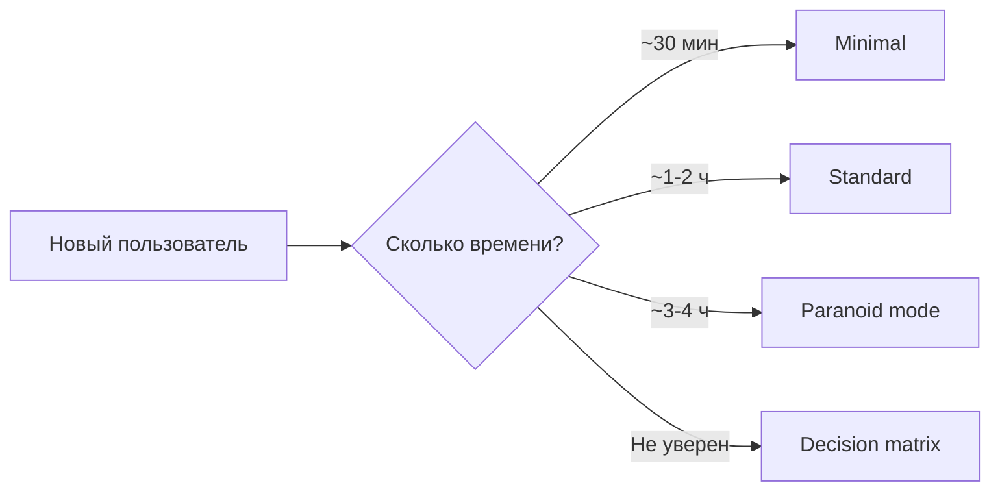
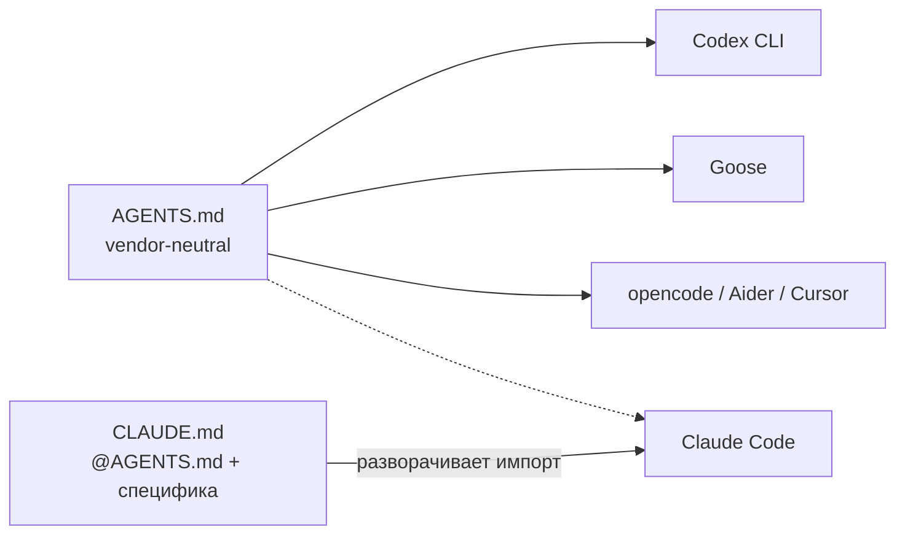

# claude-mini

> Воспроизводимый AI-assisted workflow для Claude Code: агенты, governance hook, pipeline из коробки.
> Устанавливается одной командой. Сам себя документирует.

[](docs/architecture/overview.md#governance)
[](docs/decisions/0003-sonnet-main-opus-advisor.md)

## Onboarding: выбери свой путь



## Быстрый старт (~30 мин)

**Нужно:** Claude Code, `gh` (GitHub CLI), `jq`.

```bash
git clone https://github.com/Lenivvenil/claude-mini.git ~/claude-mini
cd ~/claude-mini
./bootstrap/universal-setup.sh --install              # установить на эту машину
./bootstrap/universal-setup.sh --target <твой-проект> # подключить к проекту
```

Полный путь (prerequisites, hardware setup, первый `/review`): **[docs/onboarding/GETTING-STARTED.md §Minimal](docs/onboarding/GETTING-STARTED.md#minimal-30-мин)**

## Standard setup (~1-2 ч)

Добавляет к minimal: governance hook (проверка формата коммитов), MCP-серверы (GitHub, Serena, Context7), настройку Claude Code settings.

Полный путь: **[docs/onboarding/GETTING-STARTED.md §Standard](docs/onboarding/GETTING-STARTED.md#standard-1-2-ч)**

## Paranoid mode (~3-4 ч)

Полный стек: CI workflows, mutation testing, все агенты, ADR baseline.
Для продакшн-значимых репо.

Полный путь: **[docs/onboarding/GETTING-STARTED.md §Full](docs/onboarding/GETTING-STARTED.md#full--paranoid-mode-3-4-ч)**

---

Не знаешь с чего начать? → правило выбора в начале **[GETTING-STARTED.md](docs/onboarding/GETTING-STARTED.md)**

## Как с этим работать

| Задача | Ссылка |
|---|---|
| Ежедневный флоу | [docs/runbooks/daily-session.md](docs/runbooks/daily-session.md) |
| Новая фича | [docs/runbooks/feature-pipeline.md](docs/runbooks/feature-pipeline.md) |
| Новое архитектурное решение | [docs/runbooks/adr-workflow.md](docs/runbooks/adr-workflow.md) |
| Onboarding чужого репо | [docs/runbooks/onboarding-repo.md](docs/runbooks/onboarding-repo.md) |
| Пятничная maintenance | [docs/runbooks/weekly-maintenance.md](docs/runbooks/weekly-maintenance.md) |
| Что-то сломалось | [docs/runbooks/incident-recovery.md](docs/runbooks/incident-recovery.md) |

---

<details>
<summary>Что это и зачем (9 принципов)</summary>

Персональная AI-assisted разработческая станция, построенная на девяти принципах ([`docs/principles.md`](docs/principles.md)):

1. **Размытость — нарушение** — правильный вариант с обоснованием, или честное «не знаю + эксперимент».
2. **Claude — критик, решения принимает оператор** — агенты read-only; trade-off закрывает только человек.
3. **Сначала детерминированный тулинг, потом агент** — детерминированный тулинг первым; approval только для неотменимого.
4. **Знание живёт в репо, в репо или нигде** — ADR, issues, docs — source of truth; устный контекст = регресс.
5. **Scope — границы установки** — claude-mini влияет только туда, куда installer физически положил артефакты.
6. **Команды per-project, глобального namespace нет** — slash-команды в `.claude/commands/` каждого репо.
7. **Открытый формат — источник истины, vendor — расходник** — любой git-клиент читает всё без проприетарного GUI.
8. **Антихрупкость по домену, запас 2-3×** — 7 измерений зрелости на каждое решение; не больше нужного.
9. **Перехват — контракт** — при отказе LLM оператор продолжает с точки остановки без контекстного ввода.

Проект решает две задачи:

- **Material reference** — готовый набор агентов, skills, commands, hooks, scripts и runbooks, устанавливаемый одной командой.
- **Живая документация** — каждое решение зафиксировано как ADR, каждая процедура как runbook, каждый процесс прошёл через собственный pipeline.

Единый вводный документ со всеми тремя ярусами установки: [docs/onboarding/GETTING-STARTED.md](docs/onboarding/GETTING-STARTED.md).

</details>

<details>
<summary>Структура репо</summary>

```
docs/
├── architecture/       — как устроено целиком (слои, потоки)
├── decisions/          — ADR (MADR 4.0), решения с обоснованием
├── domain/             — термины и границы контекстов
├── principles.md       — контракт, на котором всё держится
├── anti-patterns.md    — реестр ленивых решений LLM (Принцип 4)
├── runbooks/           — пошаговые сценарии
└── metrics/            — артефакты /project-health

bootstrap/
├── hardware/           — platform-specific (Mac mini, будущий Linux)
├── agents/             — read-only критики для ~/.claude/agents/
├── skills/             — авторские тулы для ~/.claude/skills/
├── commands/           — slash-commands для ~/.claude/commands/
├── hooks/              — Claude Code hooks (PreToolUse + PostToolUse + Stop) для ~/.claude/hooks/
├── scripts/            — утилиты для ~/.claude/scripts/ и ~/bin/
├── templates/          — шаблоны (AGENTS.md, CLAUDE.md, PR template, CI workflows)
└── universal-setup.sh  — идемпотентный installer
```

</details>

<details>
<summary>Что внутри (агенты, skills, commands, hooks, scripts)</summary>

**Агенты (9):** `adr-reviewer`, `domain-reviewer`, `domain-researcher`, `solutions-architect`, `backlog-groomer`, `security-reviewer`, `docs-reviewer`, `reliability-reviewer`, `adversarial-critic` (LLM-laziness scanner, всегда в `/review`).

**Skills (4):** `adr-author` (MADR 4.0), `domain-discovery` (Event Storming), `project-bootstrap` (новый репо со всей обвязкой), `gate-audit` (еженедельный ROI-аудит gate'ов, weekly cron в CI).

**Verifier suite — per-PR:** `shellcheck` (bash), `setup-dry-run` (bash syntax + lint), `markdown-links`, `gate-audit-test`, `adr-retirement-audit-test`.

**Verifier suite — weekly cron:** **mutation testing** (`mutation.yml`, Sunday 00:00 UTC) — mutmut (Python), Stryker (TS/JS), cargo-mutants (Rust), conditional skip если язык не обнаружен. Результаты — SARIF в Code Scanning + GitHub Issue с меткой `type:mutation-report`. Surviving mutants → `docs/anti-patterns.md` по решению оператора.

**Slash commands (11):** `/plan`, `/implement`, `/adr`, `/review`, `/codex-review`, `/intent-check`, `/task-to-issue`, `/issue-to-task`, `/backlog-review`, `/project-health`, `/feature` (master orchestrator).

**Hooks (4):** `pre-commit-governance.sh` — блокирует коммиты без CC-префикса / issue-ref / ADR-ref (PreToolUse). `commit-msg-governance.sh` — те же правила на git-level; также non-blocking reminder обновить `docs/anti-patterns.md` если в ветке есть code-файлы без правок этого файла. `posttooluse-format.sh` — проверяет форматирование после Edit|MultiEdit|Write (PostToolUse, не блокирует). `stop-hook.sh` — блокирует завершение сессии если тесты не проходят (Stop).

**Scripts (8):** `mini-preflight`, `mini-session`, `mini-bootstrap-project`, `mini-health`, `review-codex.sh`, `gate-audit-lib.sh`, `gate-audit-aggregate.sh`, `forge.sh`.

</details>

<details>
<summary>MCP Servers</summary>

Три сервера, подключаемых через `.mcp.json` (repo-tracked, `--scope project`):

| Сервер | Transport | Pinned version | Назначение |
|---|---|---|---|
| `serena` | stdio | `v1.2.0` | Семантическая навигация по коду (find symbol, references) |
| `context7` | stdio | `2.2.4` | Актуальная документация библиотек (не из training data) |
| `github` | HTTP (allowlisted) | — (stable API) | Issues, PR, projects, actions |

**Транспортная политика ([ADR-0028](docs/decisions/0028-mcp-transport-security.md)):** stdio — дефолт для локальных серверов; HTTP — только для эндпоинтов из явного allowlist (`api.githubcopilot.com/mcp/`). Нет unauthenticated local HTTP MCP. stdio-серверы пинированы по semver/git-tag — CI блокирует merge без `@<version>` pin.

**Примечание по `context7`:** `@upstash/context7-mcp` запускается как локальный npm-процесс (stdio). Обращается к Upstash backend по HTTPS. stdio закрывает Claude↔local-process вектор; от Upstash изоляция не является целью.

**Quarterly review:** [docs/runbooks/mcp-quarterly-review.md](docs/runbooks/mcp-quarterly-review.md) — CVE check, pin staleness, allowlist status (Q: январь, апрель, июль, октябрь).

**При добавлении нового HTTP сервера:** нужен ADR-0028 amendment. Новые stdio серверы — добавить в `.mcp.json` с явным pin.

</details>

<details>
<summary>Как работает пайплайн</summary>

Каждая фича проходит через три управляемых цикла:

```
/feature <issue>
│
├─ FeatureRun (оркестратор) ─────────────────────────────────────────┐
│   issue → plan → (ADR?) → implement → qa                           │
│                                        │                            │
│   ┌── GovernanceRun ─────────────┐     │                            │
│   │  AttemptCommit               │     │                            │
│   │  ├─ BLOCKED → retry          │     │                            │
│   │  └─ APPROVED ✓ (terminal)    │     │                            │
│   └──────────────────────────────┘     │                            │
│                                        │                            │
│   ┌── TwoVoiceReview ────────────┐     │                            │
│   │  /review (Claude)            │     │                            │
│   │  /codex-review (Codex)       │     │                            │
│   │  ├─ agreed ✓                 │     │                            │
│   │  ├─ reconciled ✓             │     │                            │
│   │  └─ deferred ✓ (+issue)      │     │                            │
│   └──────────────────────────────┘     │                            │
│                                        │                            │
│   DoD = done iff:                      │                            │
│     GovernanceRun.state = approved  ───┘                            │
│     TwoVoiceReview.state ∈ {agreed|reconciled|deferred}             │
└─────────────────────────────────────────────────────────────────────┘
        │
        └─▶ gh pr create  (pre-PR artifact gate — issue #115)
```

**Механический gate коммитов:** `pre-commit-governance.sh` (Claude Code PreToolUse) блокирует коммит без Conventional Commits prefix + issue-ref + ADR-ref (для архитектурно-значимых изменений). `commit-msg-governance.sh` (git-level) применяет те же правила к прямым терминальным коммитам; дополнительно non-blocking reminder обновить `docs/anti-patterns.md`.

**Что обязательно на каждом этапе** — см. `docs/runbooks/feature-pipeline.md#10-pre-pr-artifact-verification`.

</details>

<details>
<summary>AGENTS.md + CLAUDE.md — два файла, два читателя</summary>



**AGENTS.md** содержит всё vendor-neutral: структуру репо, workflow-стадии, правила, governance hook, MCP-серверы. Написан в формате [AGENTS.md](https://aaif.ai/), совместимом с AAIF-стандартом.

**CLAUDE.md** — тонкий stub. Начинается с `@AGENTS.md` и добавляет только то, что специфично для Claude Code: slash-команды, таблицу субагентов, advisor policy.

**Если нужно мигрировать на другой инструмент:** большая часть pipeline переносится без усилий. Подробности — `docs/runbooks/vendor-migration.md`.

</details>

<details>
<summary>Контракт воспроизводимости и статус проекта</summary>

**Контракт воспроизводимости:**
- Любой шаг можно пройти повторно без разрушения состояния (`--install` после `--install` ничего не сломает).
- Hardware-специфичное живёт в `bootstrap/hardware/<platform>.md` и **не вызывается** из `universal-setup.sh`.
- Переход с Mac на Linux = пройти соответствующий hardware-runbook, затем запустить тот же `universal-setup.sh`.

**Статус:** первичный bootstrap проекта выполнен через собственный pipeline — каждая директория и каждый ADR созданы как самостоятельная задача (см. issues и закрытые PR с labels `type:adr`, `type:bootstrap`). Это не стайлинг, а доказательство работоспособности: если проект нельзя построить через pipeline, pipeline сломан.

</details>

## Лицензия

MIT. См. `LICENSE`.
