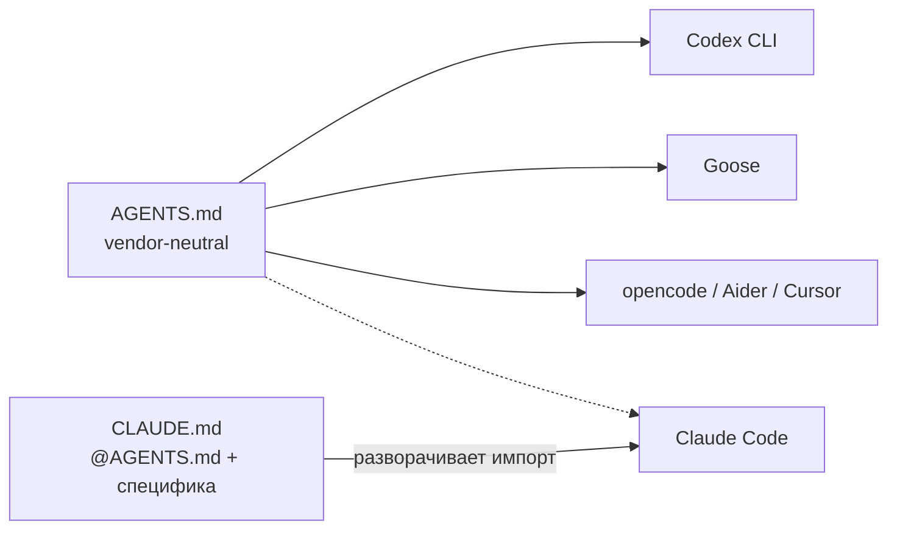

# claude-mini

> Воспроизводимый enterprise workflow для Claude Code на headless-станции. Сетап сам себя документирует и сам себя устанавливает.

[](docs/architecture/overview.md#governance)
[](docs/decisions/0003-sonnet-main-opus-advisor.md)

## Что это

Персональная AI-assisted разработческая станция, построенная на девяти принципах ([`docs/principles.md`](docs/principles.md)):

1. **Размытость — нарушение** — правильный вариант с обоснованием, или честное «не знаю + эксперимент».
2. **Claude — критик, решения принимает оператор** — агенты read-only; trade-off закрывает только человек.
3. **Сначала детерминированный тулинг, потом агент** — детерминированный тулинг первым; approval только для неотменимого.
4. **Знание живёт в репо, в репо или нигде** — ADR, issues, docs — source of truth; устный контекст = регресс.
5. **Scope — границы установки** — claude-mini влияет только туда, куда installer физически положил артефакты.
6. **Команды per-project, глобального namespace нет** — slash-команды в `.claude/commands/` каждого репо.
7. **Открытый формат — источник истины, vendor — расходник** — любой git-клиент читает всё без проприетарного GUI.
8. **Антихрупкость по домену, запас 2-3×** — 7 измерений зрелости на каждое решение; не больше нужного.
9. **Перехват — контракт** — при отказе LLM оператор продолжает с точки остановки без контекстного ввода.

Проект решает две задачи одновременно:

- **Material reference** — готовый набор агентов, skills, commands, hooks, scripts и runbooks, устанавливаемый одной командой.
- **Живая документация** — каждое решение зафиксировано как ADR, каждая процедура как runbook, каждый процесс прошёл через собственный pipeline.

## Быстрый старт

**Prerequisite (hardware layer — один раз на машине):**
См. `bootstrap/hardware/` для вашей платформы. Сейчас задокументирована `mac-mini-2018.md`.

**Universal layer (на любой машине с установленным Claude Code):**

```bash
git clone https://github.com/<owner>/claude-mini.git
cd claude-mini
./bootstrap/universal-setup.sh --check     # dry-run
./bootstrap/universal-setup.sh --install   # идемпотентно
```

Скрипт:
- копирует агентов, skills, commands, hooks, scripts в `~/.claude/`
- патчит `~/.claude/settings.json` (добавляет PreToolUse wiring через абсолютные пути)
- проверяет `gh auth`, `codex login`, `ANTHROPIC_*` env vars
- создаёт symlinks `~/bin/mini-*` на session-скрипты
- не трогает уже существующие файлы без `--force`

## Структура

```
docs/
├── architecture/       — как устроено целиком (слои, потоки)
├── decisions/          — ADR (MADR 4.0), решения с обоснованием
├── domain/             — термины и границы контекстов
├── principles.md       — контракт, на котором всё держится
├── anti-patterns.md    — реестр ленивых решений LLM (Принцип 4)
├── runbooks/           — пошаговые сценарии
└── metrics/            — артефакты /project-health

bootstrap/
├── hardware/           — platform-specific (Mac mini, будущий Linux)
├── agents/             — read-only критики для ~/.claude/agents/
├── skills/             — авторские тулы для ~/.claude/skills/
├── commands/           — slash-commands для ~/.claude/commands/
├── hooks/              — Claude Code hooks (PreToolUse + PostToolUse + Stop) для ~/.claude/hooks/
├── scripts/            — утилиты для ~/.claude/scripts/ и ~/bin/
├── templates/          — шаблоны (AGENTS.md, CLAUDE.md, PR template, CI workflows)
└── universal-setup.sh  — идемпотентный installer
```

## Что внутри

**Агенты (9):** `adr-reviewer`, `domain-reviewer`, `domain-researcher`, `solutions-architect`, `backlog-groomer`, `security-reviewer`, `docs-reviewer`, `reliability-reviewer`, `adversarial-critic` (LLM-laziness scanner, всегда в `/review`).

**Skills (4):** `adr-author` (MADR 4.0), `domain-discovery` (Event Storming), `project-bootstrap` (новый репо со всей обвязкой), `gate-audit` (еженедельный ROI-аудит gate'ов, weekly cron в CI).

**Slash commands (10):** `/plan`, `/implement`, `/adr`, `/review`, `/codex-review`, `/task-to-issue`, `/issue-to-task`, `/backlog-review`, `/project-health`, `/feature` (master orchestrator).

**Hooks (4):** `pre-commit-governance.sh` — блокирует коммиты без CC-префикса / issue-ref / ADR-ref (PreToolUse). `commit-msg-governance.sh` — применяет те же блокирующие правила к прямым терминальным коммитам (git hook); также выдаёт non-blocking reminder если `docs/anti-patterns.md` не трогался на текущей ветке при наличии code-файлов в коммите. `posttooluse-format.sh` — проверяет форматирование и lint после Edit|MultiEdit|Write и выдаёт предупреждение Claude (PostToolUse, не блокирует). `stop-hook.sh` — блокирует завершение сессии если тесты не проходят (Stop); уважает `stop_hook_active` escape-hatch.

**Scripts (8):** `mini-preflight`, `mini-session`, `mini-bootstrap-project`, `mini-health`, `review-codex.sh`, `gate-audit-lib.sh` (event-write helper), `gate-audit-aggregate.sh` (weekly aggregation), `forge.sh` (gate-tag CLI).

## AGENTS.md + CLAUDE.md — два файла, два читателя

Репо поддерживает два конфигурационных файла одновременно:



**AGENTS.md** содержит всё vendor-neutral: структуру репо, workflow-стадии, правила, governance hook, MCP-серверы. Написан в формате [AGENTS.md](https://aaif.ai/), совместимом с AAIF-стандартом.

**CLAUDE.md** — тонкий stub. Начинается с `@AGENTS.md` (Claude Code разворачивает импорт автоматически) и добавляет только то, что специфично для Claude Code: slash-команды, таблицу субагентов, advisor policy.

**Если нужно мигрировать на другой инструмент:** большая часть pipeline переносится без усилий. Подробности и пример — `docs/runbooks/vendor-migration.md`.

---

## Контракт воспроизводимости

- Любой шаг можно пройти повторно без разрушения состояния (`--install` после `--install` ничего не сломает).
- Hardware-специфичное живёт в `bootstrap/hardware/<platform>.md` и **не вызывается** из `universal-setup.sh`.
- Переход с Mac на Linux = пройти соответствующий hardware-runbook, затем запустить тот же `universal-setup.sh`.

## Как работает пайплайн

Каждая фича проходит через три управляемых цикла. Все три создаются в момент старта `/feature <issue>` и не существуют без него:

```
/feature <issue>
│
├─ FeatureRun (оркестратор) ─────────────────────────────────────────┐
│   issue → plan → (ADR?) → implement → qa                           │
│                                        │                            │
│   ┌── GovernanceRun ─────────────┐     │                            │
│   │  AttemptCommit               │     │                            │
│   │  ├─ BLOCKED → retry          │     │                            │
│   │  └─ APPROVED ✓ (terminal)    │     │                            │
│   └──────────────────────────────┘     │                            │
│                                        │                            │
│   ┌── TwoVoiceReview ────────────┐     │                            │
│   │  /review (Claude)            │     │                            │
│   │  /codex-review (Codex)       │     │                            │
│   │  ├─ agreed ✓                 │     │                            │
│   │  ├─ reconciled ✓             │     │                            │
│   │  └─ deferred ✓ (+issue)      │     │                            │
│   └──────────────────────────────┘     │                            │
│                                        │                            │
│   DoD = done iff:                      │                            │
│     GovernanceRun.state = approved  ───┘                            │
│     TwoVoiceReview.state ∈ {agreed|reconciled|deferred}             │
└─────────────────────────────────────────────────────────────────────┘
        │
        └─▶ gh pr create  (pre-PR artifact gate — issue #115)
```

**Что обязательно на каждом этапе** — см. `docs/runbooks/feature-pipeline.md#10-pre-pr-artifact-verification`. Пропуск этапа без явного основания блокирует pipeline.

**Механический gate коммитов:** `pre-commit-governance.sh` (Claude Code PreToolUse) блокирует коммит без Conventional Commits prefix + issue-ref. `commit-msg-governance.sh` (git-level) дополнительно напоминает (non-blocking) обновить `docs/anti-patterns.md`, если в этой ветке не было ни одного коммита с правками этого файла, а в текущем коммите есть code-файлы.

**Механический gate PR:** планируется в issue #115.

## Как с этим работать

- Ежедневный флоу: `docs/runbooks/daily-session.md`
- Новая фича: `docs/runbooks/feature-pipeline.md`
- Новое архитектурное решение: `docs/runbooks/adr-workflow.md`
- Onboarding существующего репо: `docs/runbooks/onboarding-repo.md`
- Пятничная maintenance: `docs/runbooks/weekly-maintenance.md`
- Что-то сломалось: `docs/runbooks/incident-recovery.md`

## Статус

Первичный bootstrap проекта выполнен через собственный pipeline — каждая директория и каждый ADR созданы как самостоятельная задача (см. issues и закрытые PR с labels `type:adr`, `type:bootstrap`). Это не стайлинг, а доказательство работоспособности: если проект нельзя построить через pipeline, pipeline сломан.

## Лицензия

MIT. См. `LICENSE`.
