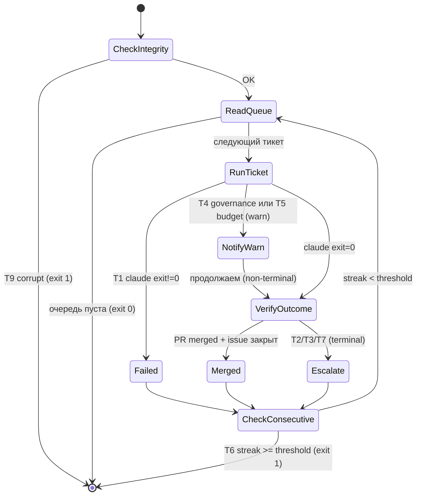

# Sprint Orchestrator — Design Document

> **Implements:** [`docs/decisions/0030-sprint-orchestrator.md`](../decisions/0030-sprint-orchestrator.md)
> **Related:** [`docs/runbooks/feature-pipeline.md`](../runbooks/feature-pipeline.md) · [`docs/runbooks/sprint.md`](../runbooks/sprint.md)
> **Status:** design-ready; implementation pending (see #44 Phase-0 conditions)

Этот документ — рабочая спецификация для разработчика `bootstrap/scripts/sprint.sh`. ADR-0030 фиксирует «что и почему»; этот файл фиксирует «как именно». При расхождении — ADR-0030 имеет приоритет.

---

## B.1 Контракт

### Входные данные

| Параметр | Обязателен | Описание |
|----------|-----------|---------|
| `--sprint-label <label>` | нет | GitHub label для фильтрации очереди (default: `Sprint`) |
| `--budget <tokens>` | нет | мягкий лимит токенов на весь sweep (default: без лимита); при превышении sweep останавливает начало новых тикетов (T5/CheckBudget), не прерывает текущую сессию |
| `--dry-run` | нет | вывести очередь тикетов и plan без запуска ни одной `claude -p` сессии; `.sprint-state` не модифицируется; Confirmation в ADR-0030 требует dry-run прохода перед merge sprint.sh |
| `--resume` | нет | продолжить прерванный sweep: прочитать `.sprint-state`, проверить GitHub-состояние `running`-тикетов, пропустить terminal-тикеты и продолжить с оставшихся |
| `--ticket <N>` | нет | обработать один конкретный тикет (debug mode); игнорирует очередь, не читает `.sprint-state` |

Переменные окружения, обязательные для работы:

```bash
CLAUDE_BIN   # путь к claude CLI (default: claude)
GH_BIN       # путь к gh CLI (default: gh)
REPO_ROOT    # абсолютный путь к корню репо (default: git rev-parse --show-toplevel)
```

### Выходные данные

| Артефакт | Где | Описание |
|----------|-----|---------|
| `.sprint-state` | `$REPO_ROOT/.sprint-state` | JSON, прогресс sweep'а |
| exit 0 | — | sweep завершён (все тикеты в terminal state) |
| exit 1 | — | sweep прерван критическим сбоем (см. B.4) |
| stdout | терминал | прогресс-лог в формате `[TICKET #N] status: ...` |

### Что оркестратор НЕ делает

- Не модифицирует `/feature`, `/plan`, `/implement` или любой другой pipeline skill
- Не принимает решений о содержании тикета — только запускает `/feature <N>` и верифицирует факты
- Не мержит PR — пост-верификация читает GitHub, но не пишет в него (кроме `needs-human` label и эскалационного комментария)
- Не управляет git-ветками напрямую — это ответственность сессии `/feature`
- Не является Claude Code skill — `sprint.sh` запускается из терминала оператором, не изнутри claude

---

## B.2 State

### `.sprint-state` — локальный кэш sweep'а

Файл создаётся при старте sweep'а, обновляется после каждого тикета. **Это кэш, не canonical state**: источник правды — GitHub (`gh issue`, `gh pr`). Если `.sprint-state` расходится с GitHub, приоритет у GitHub.

**State enum** (поле `tickets[N].state`):

| Значение | Terminal? | Описание |
|----------|-----------|---------|
| `running` | нет | сессия `/feature` активна |
| `merged` | да | PR merged, issue закрыт |
| `escalated` | да | добавлен label `needs-human` + комментарий |
| `escalation_failed` | да | попытка escalate, но gh CLI вернул ошибку |
| `failed` | да | claude exit ≠ 0, recovery невозможен |

**Минимальная схема** (то, что `state_set()` пишет сейчас):

```json
{
  "tickets": {
    "222": {"state": "merged",    "reason": "",              "tokens_used": 18400, "updated_at": "2026-05-10T14:32:11Z"},
    "223": {"state": "escalated", "reason": "no_pr_after_session", "tokens_used": 0, "updated_at": "2026-05-10T14:40:02Z"},
    "224": {"state": "failed",    "reason": "claude exit 2", "tokens_used": 0,     "updated_at": "2026-05-10T14:51:09Z"}
  }
}
```

**Целевая схема v1.0** (поля для ретро — реализовать в sprint.sh, см. B.10):

```json
{
  "sweep_id": "2026-05-10T14:00:00Z",
  "label": "Sprint",
  "started_at": "2026-05-10T14:00:00Z",
  "last_updated": "2026-05-10T14:32:11Z",
  "tickets": {
    "222": {"state": "merged",    "reason": "", "tokens_used": 18400, "updated_at": "...",
            "pr_number": 234, "session_duration_sec": 487},
    "223": {"state": "escalated", "reason": "no_pr_after_session", "tokens_used": 0, "updated_at": "...",
            "gh_comment_id": 1923847561},
    "224": {"state": "failed",    "reason": "claude exit 2", "tokens_used": 0, "updated_at": "...",
            "retry_eligible": false}
  },
  "summary": {"total": 3, "merged": 1, "escalated": 1, "failed": 1}
}
```

Файл добавлен в `.gitignore` (`/.sprint-state`). Не коммитится.

### Что читается из GitHub каждый раз (без кэша)

При каждой итерации и при пост-верификации `sprint.sh` читает из GitHub напрямую:

| Факт | Команда | Цель |
|------|---------|------|
| Список Sprint-тикетов | `gh issue list --label Sprint` | формирование очереди |
| Состояние тикета | `gh issue view N --json state,labels` | terminal state check |
| Существование PR | `gh pr list --search "Closes #N"` | post-verify merged |
| PR смержен? | `gh pr view <pr_num> --json state` | post-verify state=MERGED |
| Наличие label `needs-human` | `gh issue view N --json labels` | pre-check эскалации |

---

## B.3 Шаговая машина



`Failed` (state=failed) и `Escalate` (state=escalated) — разные terminal states (см. B.2 enum). T1 ведёт в `Failed`; T2/T3/T7 ведут в `Escalate`. T4/T5 — `NotifyWarn` (non-terminal, label+comment, без записи state). Только T6 и T9 прерывают весь sweep.

Все состояния кроме `[*]` транзиентны — при перезапуске восстанавливается с последнего незавершённого тикета из `.sprint-state`.

---

## B.4 Триггеры эскалации

*Список закрытый — добавление нового триггера требует правки этого документа и ADR-0030 Re-visit Trigger. Порядок в таблице — порядок проверки в `verify_outcome()`.  
Источник: получен из decision drivers ADR-0030 (детерминированная пост-верификация, GitHub как источник правды, continuity-контракт) и failure modes головного bash-процесса.*

| # | Триггер | Severity | Условие |
|---|---------|----------|---------|
| T1 | `process_error` | **critical** | `claude -p` завершился с exit ≠ 0 |
| T2 | `no_pr_after_session` | **critical** | сессия завершилась, PR не создан (нет open/merged PR с `Closes #N`) |
| T3 | `issue_not_closed` | **warn** | PR смержен, но issue всё ещё открыт (`Closes #N` отсутствует в PR body) |
| T4 | `governance_block` | **warn** | stdout сессии содержит `governance hook blocked` или `commit rejected`; handled by `notify()` — non-terminal |
| T5 | `budget_spike` | **warn** | токены одного тикета > `$BUDGET_SPIKE_THRESHOLD` (default: 600 000, calibrated in [#228](https://github.com/Lenivvenil/claude-mini/issues/228)); handled by `notify()` — non-terminal |
| T6 | `consecutive_failures` | **critical** | ≥3 тикетов подряд в состоянии `failed`, `escalated`, или `escalation_failed`; abort sweep, без label/comment |
| T7 | `pre_existing_needs_human` | **warn** | label `needs-human` уже висит на тикете до старта сессии |
| T8 | `no_commits_in_session` | **critical** | сессия `/feature` завершилась, в ветке нет новых коммитов и нет PR; **(deferred: TODO(#44), currently subsumed by T2)** |
| T9 | `state_file_corrupt` | **critical** | `.sprint-state` есть, но не парсится как JSON (`jq . < .sprint-state` exit ≠ 0) |
| T10 | `usage_limit` | **critical** | **(deferred — см. §B.5)** точное поле JSON output при rate-limiting неизвестно до первого прогона `sprint.sh`; трекинг: #240 |

**Поведение при эскалации — общее:**
1. Добавить label `needs-human` на issue через `gh issue edit N --add-label needs-human`
2. Оставить комментарий с trigger-id, severity и stderr-фрагментом (≤200 символов)
3. Записать в `.sprint-state["tickets"][N]["state"] = "escalated"` с trigger
4. Продолжить sweep к следующему тикету

**Исключения из общего поведения** (B.8 определяет точный контракт):

| Триггер | Отличие от общего |
|---------|------------------|
| T1 `process_error` | `state=failed`, НЕ `escalated`; label+comment через прямые gh-вызовы (без `escalate()`) |
| T4 `governance_block` | `notify()` вместо `escalate()` — non-terminal, state НЕ пишется; `verify_outcome` определит финальный state |
| T5 `budget_spike` | то же что T4 — `notify()`, non-terminal |
| T6 `consecutive_failures` | abort sweep (exit 1), без label/comment/state на swept-тикете |
| T9 `state_file_corrupt` | только stderr + exit 1; без label/comment/state (нет валидного issue для GitHub-записи) |

---

## B.5 Учёт токенов

Claude Code CLI с флагом `--output-format stream-json` выводит события в stdout как NDJSON. Событие с `type: "result"` содержит поле `usage`.

```bash
parse_usage() {
    local session_log="$1"
    local input_tokens output_tokens cache_read cache_write total
    # -R reads each line as raw string; try fromjson skips non-JSON lines (e.g. stderr text from 2>&1)
    input_tokens=$(jq -Rr '(try fromjson // null) | select(. != null and .type == "result") | .usage.input_tokens // "0"' "$session_log" | tail -1)
    output_tokens=$(jq -Rr '(try fromjson // null) | select(. != null and .type == "result") | .usage.output_tokens // "0"' "$session_log" | tail -1)
    cache_read=$(jq -Rr '(try fromjson // null) | select(. != null and .type == "result") | .usage.cache_read_input_tokens // "0"' "$session_log" | tail -1)
    cache_write=$(jq -Rr '(try fromjson // null) | select(. != null and .type == "result") | .usage.cache_creation_input_tokens // "0"' "$session_log" | tail -1)
    total=$((input_tokens + output_tokens + cache_read + cache_write))
    printf '%d' "$total"
}
```

Лог сессии пишется перенаправлением: `claude -p ... --output-format stream-json --verbose > "$session_log" 2>&1`.

Хрупкость: shape `usage` зафиксирован на момент написания ADR-0030. Если Anthropic меняет schema — парсинг сломается (Negative Consequence в ADR-0030). Validation: при парсинге ≤0 токенов — логировать `WARN: usage parse returned 0, schema may have changed`.

**T10 `usage_limit` (отложен — трекинг: #240):** точное поле JSON output при rate-limiting неизвестно до первого прогона с Pro-подпиской. После прогона: найти поле в `$session_log` (`jq 'path(..)|join(".")' | grep -i "limit\|reset\|quota"`), добавить T10 в §B.4 trigger table и в ADR-0030 (список закрытый — требует Re-visit Trigger per §B.4).

### Empirical baseline — calibration after first sprint (issue #228)

После первого реального прогона (`sprint.sh --ticket 228`, 2026-05-11) накоплена одна измеренная точка:

| Метрика | Значение |
|---------|----------|
| `input_tokens` | 14 |
| `output_tokens` | 3 305 |
| `cache_read_input_tokens` | 353 074 |
| `cache_creation_input_tokens` | 37 652 |
| **total (sum)** | **394 045** |

**Формула для ревизии threshold:**
```
new_threshold = среднее(tokens_used по закрытым тикетам) × 1.5
```

Применение к N=1: 394 045 × 1.5 = 591 068 ≈ **600 000** (округление до 100K).

**Ограничение N=1:** Тикет #228 — meta/chore с высоким cache_read (90% total). Значение нестабильно при других типах тикетов. Threshold 600 000 является предварительным (авторизовано issue #228). Ревизия — после накопления N ≥ 3–5 тикетов (трекинг: #244).

**Multiplier 1.5 сохранён:** σ при N=1 неопределима. Изменение multiplier до 2.0 без данных о разбросе — нарушение Принципа 1 (размытость без обоснования).

---

## B.6 Восстановление

Оркестратор восстанавливается после падения без потери работы. Принцип: GitHub = canonical state, `.sprint-state` = ускоритель восстановления.

**Сценарий 1: машина умерла в середине сессии claude**

```
sprint.sh --resume
```

1. Читает `.sprint-state` — определяет тикеты в состоянии `running` (если есть)
2. Для каждого `running`-тикета — проверяет GitHub: PR существует? issue закрыт?
3. Если GitHub-факты подтверждают завершение — обновляет `.sprint-state` к `merged`/`escalated`
4. Если GitHub-факты неопределённы (нет PR, issue открыт) — добавляет тикет обратно в очередь

**Сценарий 2: `.sprint-state` отсутствует**

```
sprint.sh --resume
```

1. Читает очередь из GitHub (`gh issue list --label Sprint`)
2. Для каждого тикета проверяет GitHub: закрыт? PR merged?
3. Уже обработанные тикеты (issue закрыт или `needs-human` label) — пропускает
4. Продолжает с незакрытыми тикетами

**Сценарий 3: `.sprint-state` есть, но corrupted (T9)**

`check_state_integrity` логирует ERROR в stderr и возвращает exit 1 — **без** GitHub label/comment и без `state_set` (нет валидного issue, корраптный файл нельзя трогать). Sweep прерывается. Оператор удаляет `.sprint-state` и запускает `sprint.sh --resume` — применится Сценарий 2.

---

## B.7 Чтение очереди из канбана

Очередь формируется из GitHub Issues с label `Sprint` (или `--sprint-label`), отсортированных по приоритету.

```bash
read_queue() {
    local sprint_label="$1"
    local queue_file="$2"

    if ! gh issue list \
        --label "$sprint_label" \
        --state open \
        --json number,title,labels \
        --jq '
        map(select(
            (.labels | map(.name) | any(. == "needs-human")) | not
        ))
        | map(select(
            (.labels | map(.name) | any(. == "blocked")) | not
        ))
        | sort_by(
            if (.labels | map(.name) | any(. == "P0-critical")) then 0
            elif (.labels | map(.name) | any(. == "P1-high")) then 1
            elif (.labels | map(.name) | any(. == "P2-medium")) then 2
            else 3
            end
        ) | .[].number' \
        > "$queue_file"
    then
        echo "ERROR: gh issue list failed" >&2
        return 1
    fi

    if [ ! -s "$queue_file" ]; then
        echo "INFO: Sprint queue is empty (no open issues with label '$sprint_label')"
        return 0
    fi

    echo "INFO: Queue ready ($(wc -l < "$queue_file") tickets)"
}
```

Фильтры при формировании очереди:

- Исключить тикеты с label `needs-human` (уже эскалированы)
- Исключить тикеты с label `blocked` (ждут внешнего разблокирования)
- Если `--resume`: исключить тикеты, уже записанные в `.sprint-state` с terminal state

Сортировка: P0 → P1 → P2 → P3 (без priority-label = P3). Внутри одного приоритета — по номеру issue (ascending).

---

## B.8 Главный цикл

### `process_sprint_queue`

```bash
process_sprint_queue() {
    local sprint_label="$1"
    local queue_file
    queue_file=$(mktemp)

    if ! read_queue "$sprint_label" "$queue_file"; then
        rm -f "$queue_file"
        return 1
    fi

    local -a tickets
    mapfile -t tickets < "$queue_file"
    rm -f "$queue_file"

    local ticket_number
    for ticket_number in "${tickets[@]}"; do
        # CheckBudget: if --budget was passed, stop starting new tickets when cumulative spend exceeds it.
        if [ -n "${BUDGET:-}" ] && [ -f "${REPO_ROOT}/.sprint-state" ]; then
            local spent
            spent=$(jq '[.tickets[].tokens_used] | add // 0' "${REPO_ROOT}/.sprint-state" 2>/dev/null || echo 0)
            if [ "${spent:-0}" -ge "${BUDGET}" ]; then
                echo "INFO: Budget ${BUDGET} tokens exhausted (spent ${spent}). Stopping new tickets." >&2
                break
            fi
        fi

        if ! run_ticket "$ticket_number"; then
            echo "WARN: run_ticket $ticket_number returned non-zero" >&2
        fi
        if check_consecutive_failures; then
            # T6: abort the sweep — individual tickets already carry their terminal states.
            # Do NOT call escalate() here: it would overwrite the last ticket's terminal state.
            echo "CRITICAL: consecutive failures threshold reached — aborting sweep (T6)" >&2
            return 1
        fi
    done

    return 0
}
```

### `run_ticket`

```bash
run_ticket() {
    local ticket_number="$1"

    if ! printf '%s' "$ticket_number" | grep -qE '^[0-9]+$'; then
        echo "ERROR: invalid ticket_number '${ticket_number}' (must be numeric)" >&2
        return 1
    fi

    local session_log
    session_log=$(mktemp)
    local claude_exit

    # T7: check for pre-existing needs-human BEFORE session starts and BEFORE any notify() call.
    # Cannot rely on labels read in verify_outcome(): notify() (T4/T5) adds needs-human mid-run.
    local pre_labels
    pre_labels=$(gh issue view "$ticket_number" --json labels --jq '[.labels[].name]' 2>/dev/null || echo "[]")
    if echo "$pre_labels" | jq -e 'any(. == "needs-human")' > /dev/null 2>&1; then
        echo "[TICKET #${ticket_number}] T7 pre_existing_needs_human — skipping" >&2
        state_set "$ticket_number" "escalated" "pre_existing_needs_human"
        return 0
    fi

    echo "[TICKET #${ticket_number}] starting /feature session"
    state_set "$ticket_number" "running" ""

    local claude_exit=0
    "$CLAUDE_BIN" -p "/feature ${ticket_number}" \
        --output-format stream-json \
        --verbose \
        --max-turns "${MAX_TURNS}" \
        > "$session_log" 2>&1 || claude_exit=$?

    if [ "$claude_exit" -ne 0 ]; then
        echo "[TICKET #${ticket_number}] T1 process_error: claude exited ${claude_exit}" >&2
        # T1 is terminal with state=failed (not escalated). Handle gh writes inline
        # so we can capture exit codes and set escalation_failed if GitHub is unreachable.
        local t1_label_exit t1_comment_exit
        gh issue edit "$ticket_number" --add-label "needs-human" > /dev/null 2>&1
        t1_label_exit=$?
        gh issue comment "$ticket_number" \
            --body "sprint.sh: T1 process_error — claude exit ${claude_exit}" > /dev/null 2>&1
        t1_comment_exit=$?
        if [ "$t1_label_exit" -ne 0 ] || [ "$t1_comment_exit" -ne 0 ]; then
            echo "ERROR: gh write failed for T1 on #${ticket_number} (label=${t1_label_exit} comment=${t1_comment_exit})" >&2
            state_set "$ticket_number" "escalation_failed" "process_error"
        else
            state_set "$ticket_number" "failed" "claude exit ${claude_exit}"
        fi
        rm -f "$session_log"
        return 1
    fi

    local tokens_used
    tokens_used=$(parse_usage "$session_log")

    # T4: governance_block (warn, non-terminal) — session stdout contains hook rejection string.
    # Uses notify(), not escalate(): verify_outcome still runs to determine final terminal state.
    if grep -q "governance hook blocked\|commit rejected" "$session_log" 2>/dev/null; then
        local t4_detail
        t4_detail=$(grep -m1 "governance hook blocked\|commit rejected" "$session_log" | head -c 200)
        notify "$ticket_number" "governance_block" "$t4_detail"
    fi

    # T5: budget_spike (warn, non-terminal) — token usage exceeded per-ticket threshold.
    # Uses notify(): the ticket may still have a merged PR; verify_outcome writes final state.
    if [ "${tokens_used:-0}" -gt "${BUDGET_SPIKE_THRESHOLD:-600000}" ]; then
        notify "$ticket_number" "budget_spike" "${tokens_used} tokens"
    fi

    verify_outcome "$ticket_number" "$tokens_used"
    local verify_exit=$?
    rm -f "$session_log"
    return "$verify_exit"
}
```

### `verify_outcome`

```bash
verify_outcome() {
    local ticket_number="$1"
    local tokens_used="$2"
    local issue_state pr_state

    issue_state=$(gh issue view "$ticket_number" --json state --jq '.state')

    if [ "$issue_state" = "CLOSED" ]; then
        pr_state=$(gh pr list \
            --search "Closes #${ticket_number}" \
            --state merged \
            --json number,state \
            --jq '.[0].state // empty')
        if [ "$pr_state" = "MERGED" ]; then
            state_set "$ticket_number" "merged" "" "$tokens_used"
            echo "[TICKET #${ticket_number}] merged OK (${tokens_used} tokens)"
            return 0
        fi
    fi

    local pr_exists
    pr_exists=$(gh pr list --search "Closes #${ticket_number}" --json number --jq 'length')
    if [ "${pr_exists:-0}" -eq 0 ]; then
        escalate "$ticket_number" "no_pr_after_session" "critical"
        return 1
    fi

    escalate "$ticket_number" "issue_not_closed" "warn"
    return 0
}
```

### `escalate` (terminal — critical severity)

Writes state=escalated. Use only for triggers that terminate ticket processing: T2, T3, T7 (from `verify_outcome`), T6 (from `process_sprint_queue`). T1 is handled inline in `run_ticket` (state=failed, not escalated). T4/T5 use `notify()` instead (non-terminal warns).

```bash
escalate() {
    local ticket_number="$1"
    local trigger="$2"
    local severity="$3"
    local detail="${4:-}"
    local comment_body

    comment_body="sprint.sh escalation: trigger=${trigger} severity=${severity}"
    if [ -n "$detail" ]; then
        comment_body="${comment_body} detail=$(printf '%s' "$detail" | head -c 200)"
    fi

    local gh_label_exit gh_comment_exit
    gh issue edit "$ticket_number" --add-label "needs-human" > /dev/null 2>&1
    gh_label_exit=$?
    gh issue comment "$ticket_number" --body "$comment_body" > /dev/null 2>&1
    gh_comment_exit=$?

    if [ "$gh_label_exit" -ne 0 ] || [ "$gh_comment_exit" -ne 0 ]; then
        # GitHub write failed: record escalation_failed so .sprint-state matches GitHub reality.
        # ADR-0030 §Decision: GitHub is canonical; swallowing failures would invert the contract.
        echo "ERROR: gh escalation write failed for #${ticket_number} (label=${gh_label_exit} comment=${gh_comment_exit})" >&2
        state_set "$ticket_number" "escalation_failed" "$trigger"
        return 1
    fi

    state_set "$ticket_number" "escalated" "$trigger"
    echo "[TICKET #${ticket_number}] escalated: ${trigger} (${severity})"
}
```

### `notify` (non-terminal — warn severity)

Adds `needs-human` label and comment but does NOT write state. Use for T4/T5 (warn-level triggers that fire before `verify_outcome`): the ticket may still succeed, and `verify_outcome` writes the final terminal state.

```bash
notify() {
    local ticket_number="$1"
    local trigger="$2"
    local detail="${3:-}"
    local comment_body

    comment_body="sprint.sh warn: trigger=${trigger}"
    if [ -n "$detail" ]; then
        comment_body="${comment_body} detail=$(printf '%s' "$detail" | head -c 200)"
    fi

    gh issue edit "$ticket_number" --add-label "needs-human" > /dev/null 2>&1 || \
        echo "WARN: gh label add failed for #${ticket_number} trigger=${trigger}" >&2
    gh issue comment "$ticket_number" --body "$comment_body" > /dev/null 2>&1 || \
        echo "WARN: gh comment failed for #${ticket_number} trigger=${trigger}" >&2

    echo "[TICKET #${ticket_number}] warn: ${trigger}"
}
```

### `state_set` (вспомогательная)

```bash
state_set() {
    local ticket_number="$1"
    local new_state="$2"
    local reason="$3"
    local tokens="${4:-0}"
    local state_file="${REPO_ROOT}/.sprint-state"
    local now
    now=$(date -u +%Y-%m-%dT%H:%M:%SZ)

    if [ ! -f "$state_file" ]; then
        printf '{"tickets":{}}\n' > "$state_file"
    fi

    local updated
    updated=$(jq \
        --arg n "$ticket_number" \
        --arg s "$new_state" \
        --arg r "$reason" \
        --arg t "$tokens" \
        --arg ts "$now" \
        '.tickets[$n] = {state: $s, reason: $r, tokens_used: ($t | tonumber), updated_at: $ts}' \
        "$state_file")
    printf '%s\n' "$updated" > "$state_file"
}
```

### `check_consecutive_failures` (T6)

Returns 0 (bash-true) if the last `CONSECUTIVE_FAILURE_THRESHOLD` (default: 3) completed tickets are all `failed` or `escalated`. Called by `process_sprint_queue` after each ticket.

```bash
check_consecutive_failures() {
    local state_file="${REPO_ROOT}/.sprint-state"
    local threshold="${CONSECUTIVE_FAILURE_THRESHOLD:-3}"

    if [ ! -f "$state_file" ]; then
        return 1
    fi

    local count=0
    local recent_states
    recent_states=$(jq -r --argjson t "$threshold" '
        [.tickets | to_entries[] | {s: .value.state, ts: .value.updated_at}]
        | sort_by(.ts) | reverse | .[:$t] | .[].s
    ' "$state_file" 2>/dev/null)

    if [ -z "$recent_states" ]; then
        return 1
    fi

    while IFS= read -r state; do
        if [ "$state" = "failed" ] || [ "$state" = "escalated" ] || [ "$state" = "escalation_failed" ]; then
            count=$((count + 1))
        fi
    done <<< "$recent_states"

    [ "$count" -ge "$threshold" ]
}
```

### T9 — state integrity check (startup)

Run at the start of every sweep (both fresh and `--resume`). T9 does NOT call `escalate()` — there is no valid GitHub issue to target, and calling `state_set` against a corrupt file would destroy it. Log to stderr and abort.

```bash
check_state_integrity() {
    local state_file="${REPO_ROOT}/.sprint-state"

    if [ ! -f "$state_file" ]; then
        return 0
    fi

    if ! jq . < "$state_file" > /dev/null 2>&1; then
        echo "ERROR: .sprint-state is corrupt (not valid JSON). Delete it and rerun with --resume to recover." >&2
        return 1
    fi

    return 0
}
```

T8 (`no_commits_in_session`) is subsumed by T2 (`no_pr_after_session`) in the current implementation: if no PR exists and no commits were made, T2 fires first. A more precise T8 check (grep session log for Write/Edit tool calls) is deferred to sprint.sh v1.0. TODO(#44).

---

## B.9 Гейты против филонства

Оркестратор — второй слой защиты. Первый слой — `docs/anti-patterns.md` и его детекторы внутри `/review`.

### Слой 1: anti-patterns.md (внутри каждой `/feature` сессии)

Каждая сессия `claude -p "/feature N"` запускает полный pipeline включая `/review` с `adversarial-critic`. `adversarial-critic` загружает `docs/anti-patterns.md` и проверяет diff на все 8 паттернов (truncated-file, symptom-fix-not-root, narrow-special-case, adr-drift, hedging-in-plan, fail-open-default, todo-without-ticket, commented-block). BLOCK-finding блокирует merge.

Оркестратор не дублирует эти проверки — он проверяет детерминированный факт: PR merged? Если нет — эскалирует.

### Слой 2: sprint-orchestrator (между сессиями)

| Триггер | Детектор | Ответ оркестратора |
|---------|----------|--------------------|
| T1 `process_error` | `run_ticket`: claude exit ≠ 0 | `state=failed` + escalate critical |
| T2 `no_pr_after_session` | `verify_outcome`: `gh pr list` length=0 | escalate critical + `needs-human` |
| T3 `issue_not_closed` | `verify_outcome`: issue state=OPEN после PR merged | escalate warn + `needs-human` |
| T4 `governance_block` | `run_ticket`: grep session log | notify warn (non-terminal, no state write) + `needs-human` |
| T5 `budget_spike` | `run_ticket`: tokens > `$BUDGET_SPIKE_THRESHOLD` | notify warn (non-terminal, no state write) + `needs-human` |
| T6 `consecutive_failures` | `check_consecutive_failures`: streak ≥ threshold | abort sweep (exit 1); без label/comment/state |
| T7 `pre_existing_needs_human` | `verify_outcome`: label check before escalate | escalate warn (пропустить тикет) |
| T8 `no_commits_in_session` | T2 покрывает большинство случаев; точный детектор (session log grep) — TODO(#44) | (через T2) |
| T9 `state_file_corrupt` | `check_state_integrity` (startup) | abort sweep (exit 1) |

Смысл двойного слоя: `anti-patterns.md` ловит качественные проблемы (lazy LLM code) внутри сессии; sprint-orchestrator ловит pipeline-skip проблемы (сессия завершилась не оставив обязательного артефакта) снаружи сессии.

---

## B.10 Что добавить для ретро

После каждого sweep'а `.sprint-state` содержит данные для retrospective. Текущая схема покрывает:

| Метрика | Поле в `.sprint-state` | Готовность |
|---------|------------------------|-----------|
| Токены на тикет | `tickets[N].tokens_used` | реализовать в B.5 |
| Длительность сессии | `tickets[N].session_duration_sec` | добавить в `run_ticket` |
| Причина эскалации | `tickets[N].escalation_trigger` | реализовать в B.4 |
| Итоговый sweep count | `summary.*` | реализовать в финальном write |
| Aggregate token budget | sum `tokens_used` по всем merged | вычислять post-sweep |

Что НЕ пишется в `.sprint-state` (но должно войти в ретро-отчёт):

- Время ожидания human approval на PR (разница между created и merged) — нужен доп. `gh pr view --json createdAt,mergedAt`
- Частота reviewer-comments per PR — `gh pr reviews` + `gh pr comments`
- ADR-drift incidents (когда `adr-reviewer` заблокировал) — читать из PR comment thread

Команда для быстрого ретро-дайджеста (запустить после sweep):

```bash
jq '{
  total: .summary.total,
  merged: .summary.merged,
  escalated: .summary.escalated,
  failed: .summary.failed,
  total_tokens: [.tickets[].tokens_used] | add,
  avg_tokens: (([.tickets[].tokens_used] | add) / .summary.total | floor)
}' .sprint-state
```
