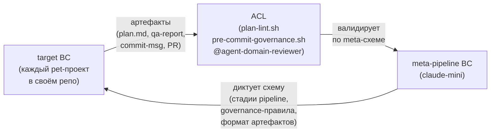

# Context Map — meta-pipeline BC ↔ target BC

**Версия:** 2026-05-06
**Статус:** current as of ADR-0027 (Domain Inversion, issue #130). Текстовый Bounded Context Canvas + Mermaid-диаграмма.
**Язык:** русский (внутренний артефакт).
**Связанные документы:** `docs/domain/meta/vocabulary.md` (UL для meta-pipeline BC), `docs/domain/meta/overview.md` (агрегаты и политики meta-pipeline BC), `docs/decisions/0027-domain-inversion-meta-vs-target-bc.md`.

## Диаграмма

**Типы стрелок:**
- `target → ACL → meta`: Conformist (target конформируется к схеме meta) + ACL (meta защищает себя валидацией входящих артефактов) = **AACL**
- `meta → target`: upstream-of-schema; meta не принимает требований от target об изменении схемы

**Session Continuity BC** (ADR-0024): отдельный sibling-BC; отношение к meta-pipeline BC (sibling vs вложенный) — TBD в follow-up issue. Не показан на диаграмме до прояснения.

---

## Общая структура

После Domain Inversion (issue #130) репозиторий `claude-mini` декомпозируется на:

1. **meta-pipeline BC** — каркас AI-конвейера. Универсален; не зависит от конкретного pet-проекта.
2. **target BC** (родовое имя; в каждом pet-проекте свой) — доменная модель конкретного проекта. Например, для `archi2likec4` это контекст «диаграммы C4 как код»; для других pet-проектов — иные агрегаты.
3. **ACL (Anti-Corruption Layer)** — слой трансляции и валидации на стыке. Технически расположен внутри meta (meta защищает свою схему); концептуально является границей между BC.

Границы и направление зависимости таковы, что **target конформируется к meta**, а не наоборот: target использует словарь стадий pipeline (plan, ADR, implement, review), словарь governance (Conventional Commits, issue-ref, ADR-ref) и протокол two-voice review. Meta при этом не знает доменных терминов target.

---

## meta-pipeline BC

### Ответственность

- Описывать и оркестрировать **feature-pipeline**: stage-machine `issue → plan → adr? → implement → qa → review → codex-review → governance → PR`.
- Владеть **governance-схемой**: правила Conventional Commits, обязательность issue-ref, обязательность ADR-ref для архитектурно-значимых изменений.
- Владеть протоколом **two-voice review** (Claude `/review` + Codex `/codex-review`) и его терминальными состояниями.
- Владеть **advisor-policy**: когда вызывать advisor, минимальное число вызовов на нетривиальной задаче.
- Владеть моделью **runbook-исполнений** (out-of-band процедуры, не привязанные к одному `FeatureRun`).
- Валидировать через ACL все артефакты, которые target отдаёт обратно в meta (plan.md, ADR-черновик, qa-report, PR-description, commit-message).

### Агрегатные корни

- `FeatureRun` (оркестратор pipeline) — см. `docs/domain/meta/vocabulary.md`.
- `GovernanceRun` (commit-governance episode) — см. там же.
- `TwoVoiceReview` (two-voice review episode) — см. там же.
- `RunbookExecution` (runbook execution episode) — провижионально, см. red hotspot в `vocabulary.md`.

### Канонический язык (краткий список)

`FeatureRun`, `GovernanceRun`, `TwoVoiceReview`, `RunbookExecution`, `dod_state`, `advisor_call_count`, `issue_ref`, `Pipeline Stage`, `Layer 1 Gate`, `Read-only Critic`, `Author-gateway`, `Skill`, `Main Loop`, `Advisor`, `Operator`, `ACL`, `Domain Inversion`, `meta-pipeline BC`. Полные определения — в `docs/domain/meta/vocabulary.md` (канонический файл после ADR-0027).

### Что **не** входит в ответственность meta

- Доменные правила любого pet-проекта (например, инварианты `C4-Diagram` в archi2likec4).
- Структура target-артефактов сверх того, что валидирует ACL (meta не знает, что внутри `plan.md` написано в свободных абзацах — только что есть требуемые секции).
- Внутренности Claude Code, Anthropic API, Codex CLI, GitHub.

---

## target BC (родовая характеристика)

### Ответственность

- Описывать **доменную модель конкретного pet-проекта**: агрегаты, инварианты, события, политики, актёров.
- Производить **target-артефакты**, которые потом передаются в meta через ACL:
  - `plan.md` (с шестью обязательными секциями: формулировка, файлы, подходы, выбранный подход, тестирование, риски);
  - ADR-черновик (если архитектурно значимо), формат MADR 4.0;
  - `qa-report.md` (после `/qa`);
  - изменения в коде / документации / схемах данных;
  - commit-message (Conventional Commits + issue-ref + ADR-ref если применимо);
  - PR-description (`Closes #NNN`, ссылка на ADR).
- Определять собственные acceptance criteria для своих issue (которые потом проверяет `/intent-check`).

### Агрегатные корни (примеры)

Зависят от конкретного pet-проекта. Для иллюстрации:
- **archi2likec4 target BC:** `C4-Diagram`, `ContainerLayer`, и т. п.
- Другие pet-проекты репозитория `~/code/`: каждый имеет свой набор корней.

В meta-pipeline BC эти корни **не упоминаются по имени**. Meta знает о существовании *чего-то*, что target называет «своим доменом», но не знает, что именно.

### Канонический язык

Уникален для каждого target. Не пересекается со словарём meta, кроме случаев, когда термин официально импортирован: тогда target использует meta-определение без переопределения (например, target использует `FeatureRun.issue_ref`, не определяя `issue_ref` заново).

### Что **не** входит в ответственность target

- Стадии pipeline, их порядок, условия пропуска.
- Формат commit-message, правила governance.
- Протокол two-voice review.
- Правила вызова advisor.

---

## ACL между BC

### Расположение и направление трансляции

ACL расположен **на стороне meta** (принимающего BC) и переводит **из target → в meta**. Это согласуется с DDD-каноном: ACL защищает свой BC от чужого словаря.

**Уточнение асимметрии направлений.** meta находится в двух разных позициях относительно target одновременно: **upstream по схеме** (meta диктует target формат plan.md, правила governance, протокол review) и **downstream по артефактам** (meta получает на вход от target готовые артефакты, чьё содержимое надо валидировать). ACL расположен на edge, где meta принимает артефакты — то есть на «downstream-of-artifacts» крае. Это устраняет возможное противоречие: ACL — это всегда защита downstream-стороны от upstream-словаря; здесь downstream — это поток артефактов, а не поток схемы.

Обратное направление (meta → target) ACL не требует: meta не передаёт target доменных данных, только дисциплинарные ограничения и шаблоны (что написать в plan.md, какой формат у commit-message). Эти ограничения формулируются в meta-словаре и target обязан им конформироваться напрямую.

### Что валидирует ACL

| Тип target-артефакта | Что проверяется ACL | Текущая реализация |
|---|---|---|
| `plan.md` | Наличие шести обязательных секций; ADR-ref discipline в §3 и §4 (`plan-lint.sh`); явная маркировка «no ADR — justification: ...» при отсутствии ADR | `bootstrap/scripts/plan-lint.sh` |
| ADR-черновик | Соответствие MADR 4.0; присутствие всех обязательных секций | `@agent-adr-reviewer` (semi-automated) |
| `qa-report.md` | Существование документа после `/qa`; non-empty | Honor system (Internal Compliance) |
| commit-message | Conventional Commits prefix; `#NNN` issue-ref; `Implements docs/decisions/NNNN-*.md` для ADR-significant изменений | `pre-commit-governance.sh` (PreToolUse) + `commit-msg-governance.sh` (`.git/hooks/commit-msg`) |
| PR-description | `Closes #NNN`; ссылка на ADR если был | Honor system |
| Изменения в `docs/domain/` | Согласованность UL, отсутствие drift | `@agent-domain-reviewer` (post-edit) |

Замечание: текущая реализация ACL **фрагментарна** — нет одной точки, где все правила проверяются разом. Это корректно с точки зрения архитектуры (каждое правило применяется на своей стадии), но осложняет рассуждение о «полном ACL» как одном объекте. Вопрос, является ли это единым концептуальным ACL или коллекцией ACL-фрагментов, — red hotspot в `vocabulary.md`.

### Правила трансляции

1. **Имена target-агрегатов в meta не появляются.** В commit-message может быть упомянут `C4-Diagram` как часть свободного текста, но meta-компоненты (`FeatureRun`, governance-хук) не парсят это имя как доменный термин.
2. **target не использует прямой доступ к meta-агрегатам.** target не пишет в `dod_state` напрямую — переход совершается meta-стороной по событиям pipeline.
3. **Артефакт, не прошедший ACL, не попадает во внутреннюю модель meta.** Например, commit без issue-ref блокируется `GovernanceRun`; меняет это решение target — переписывая commit-message, не обходя хук.
4. **ACL не модифицирует артефакт.** Исправление — обязанность target.

### Что ACL не делает

- Не выполняет authentication (кто отправитель).
- Не выполняет authorization (есть ли права).
- Не транслирует target-доменные термины во внутренние meta-термины — таких трансляций нет, потому что meta не знает target-словарь.

---

## Тип связи между BC

Брифом задан вопрос о DDD-паттерне связи. Однозначно один паттерн не выбирается; ниже — рассуждение и предложенный паттерн с указанием альтернатив.

**Дискриминатор для выбора:** кто зависит от чьего словаря и кто кого защищает от изменений.

- **target использует словарь и схему meta** (стадии pipeline, governance-правила, формат артефактов). Если meta меняет схему (например, добавляет седьмую секцию в plan.md), target обязан адаптироваться. → Это признак **Conformist** со стороны target к meta.
- **meta защищает себя от target-артефактов через ACL**, валидируя их по схеме перед впуском во внутреннюю модель. → Это признак **Anti-Corruption Layer** со стороны meta.

Оба признака сосуществуют. Это в точности паттерн, описанный Synpulse8 как **AACL (Anti-Corruption Layer over Conformist)**: target конформирует к словарю meta, и одновременно meta защищается ACL от частичной несогласованности target-артефактов с этим словарём.

**Предлагаемый итоговый тип связи:** AACL (Conformist downstream + ACL upstream).

**Альтернативы, которые рассмотрены и отклонены:**
- **Customer/Supplier:** предполагает, что upstream (meta) обязан учитывать downstream-нужды (target) в своей schema-evolution. В данном репозитории это не так: meta-схема единая для всех pet-проектов; pet-проекты не получают права требовать изменений в meta под их специфику.
- **Partnership:** предполагает синхронную координацию между BC и совместное планирование релизов. Здесь meta развивается отдельно от каждого target-проекта; синхронной координации нет.
- **Shared Kernel:** предполагает общий код / общий словарь. Здесь target не разделяет с meta никакого общего ядра — он только конформирует к схеме.
- **Open Host Service / Published Language:** meta могла бы быть OHS, но против этого: target не имеет публикуемого формального языка для своего домена, который meta потребляет; направление обратное — это target потребляет язык meta.

**Red hotspot по выбору паттерна:**
- Если будущая интерпретация развернётся в сторону «target имеет право требовать расширений у meta» (например, разные target-проекты потребуют разных стадий pipeline), паттерн сместится к Customer/Supplier + ACL. Сейчас оснований для этого нет.
- Если у разных target-проектов окажутся достаточно общие доменные элементы, чтобы выделить общий под-словарь (например, все target используют какой-то общий тип «entity»), может появиться Shared Kernel. Сейчас оснований для этого нет.

---

## Открытые вопросы (red hotspots)

1. **Реальная декомпозиция meta.** В этом артефакте «meta-pipeline BC» представлен как один BC с четырьмя агрегатными корнями. Альтернатива — разнести в несколько BC верхнего уровня (например, отдельный BC «Governance», отдельный BC «Review»). Текущий выбор — один BC, потому что инварианты `FeatureRun`, `GovernanceRun`, `TwoVoiceReview` ссылаются друг на друга через cross-aggregate query (ADR-0020), что делает их частью одной модели согласованности.
2. **Соотношение с Session Continuity BC.** ADR-0024 объявил Session Continuity отдельным BC. После Domain Inversion статус Session Continuity относительно meta-pipeline BC требует уточнения: sibling одного meta-уровня, или вложенный sub-BC. Эффект на context-map: возможно появление третьего узла «Session Continuity BC» с собственным ACL-стыком к meta-pipeline.
3. **`RunbookExecution` как агрегатный корень.** Не подтверждено интервью. Если выяснится, что runbook-исполнения — часть жизненного цикла `FeatureRun` (для тех runbook-ов, которые вызываются изнутри run, например `incident-recovery.md`), четвёртого агрегатного корня в meta не будет; вместо него появится сущность `RunbookExecution` внутри `FeatureRun`. Решение требует Event Storming.
4. **Единая ACL-точка vs коллекция ACL-фрагментов.** Существующая реализация распределяет валидацию по нескольким артефактам (plan-lint, governance-хук, агенты-критики). Открытый вопрос для будущего ADR: моделировать это как один концептуальный ACL с несколькими реализационными точками, или как несколько ACL по одному на тип артефакта.
5. **Список target-проектов и их target BC.** Пока в репозитории явно идентифицирован один target — archi2likec4 (см. `~/code/digest`, дополнительный workspace). Полный реестр target-проектов и их target BC не зафиксирован. Это влияет на проверку «meta универсален»: гипотеза, не подтверждённая на нескольких target-проектах.
6. **Перенос терминов из top-level `vocabulary.md` в `meta/vocabulary.md`.** Часть терминов (`Operator`, `Skill`, `ADR`, `Layer 1 Gate`, `Pipeline Stage`, `Canonical Pipeline`, `Read-only Critic`, `Author-gateway` и т. д.) семантически принадлежит meta, но физически осталась в top-level до отдельной reorganisation-сессии. До её завершения возможна неоднозначность по принадлежности термина.
