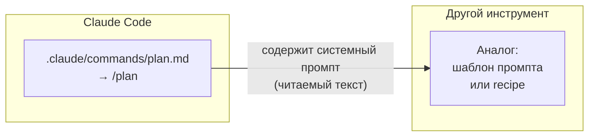
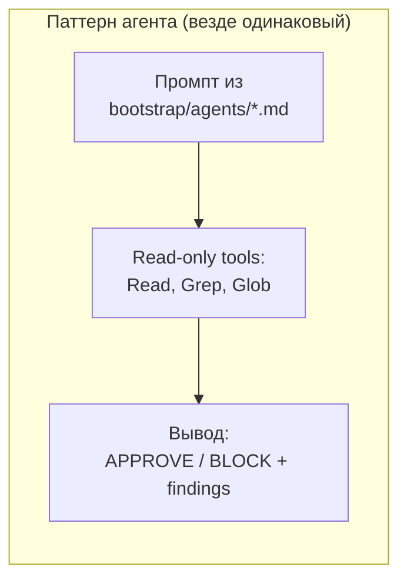

# Runbook: миграция pipeline на другой AI-инструмент

Этот runbook отвечает на вопрос: **что делать, если Claude Code больше недоступен?**

Нет пожара — это план действий на случай если он понадобится. Часть pipeline переносится сразу, часть требует небольшой работы.

---

## Что переносится сразу, без усилий

Три компонента уже vendor-agnostic:

### 1. AGENTS.md — контекст репо

`AGENTS.md` написан по стандарту AAIF (Linux Foundation). Любой современный AI-инструмент читает его нативно:

| Инструмент | Читает AGENTS.md? |
|---|---|
| Codex CLI (OpenAI) | ✅ Нативно |
| Goose (Block) | ✅ Нативно |
| opencode (sst) | ✅ Нативно |
| Aider | ✅ Нативно |
| Cursor | ✅ Нативно |
| Claude Code | ✅ Через `@AGENTS.md` import в CLAUDE.md |

**Что делать:** просто открыть репо в новом инструменте. Он найдёт AGENTS.md и поймёт структуру, правила и workflow.

### 2. Governance hook — git commit-msg hook

`bootstrap/hooks/commit-msg-governance.sh` — это git commit-msg hook (ADR-0011). Требует `bash`, `git`, `jq`.

**Что делать** (выполнять из корня claude-mini):

```bash
# Скопировать в целевое репо:
cp bootstrap/hooks/commit-msg-governance.sh /path/to/project/.git/hooks/commit-msg
chmod +x /path/to/project/.git/hooks/commit-msg

# Проверить — должен заблокировать сообщение без CC-префикса:
echo "add something" > /tmp/msg && bash /path/to/project/.git/hooks/commit-msg /tmp/msg
echo "Exit: $?"  # 1 = заблокировано ✓

# Проверить — должен пропустить корректное сообщение:
echo "feat: add feature #127" > /tmp/msg && bash /path/to/project/.git/hooks/commit-msg /tmp/msg
echo "Exit: $?"  # 0 = OK ✓
```

Хук будет проверять Conventional Commits и issue-refs при каждом коммите, независимо от AI-инструмента.

### 3. MCP-серверы — открытый протокол

MCP (Model Context Protocol) — открытый стандарт. Те же серверы работают в Goose, opencode, Cursor и других клиентах.

**Что делать:** настроить те же три сервера в конфиг-файле нового инструмента:

| Сервер | Что делает | Как подключить |
|---|---|---|
| **Serena** | Семантическая навигация по коду | `uvx serena` (Python); восстановить: `uvx --reinstall serena` |
| **GitHub** | Issues, PR, projects | Официальный [GitHub MCP server](https://github.com/github/github-mcp-server) |
| **Context7** | Документация библиотек | [Context7 MCP](https://github.com/upstash/context7) — проверь актуальное имя пакета в репо |

> ⚠️ Имена пакетов и команды установки меняются. Перед запуском сверяй с официальным репо инструмента, а не с этим runbook. Unpinned MCP-серверы — риск supply chain (см. `docs/synthesis/2026-04-29-pipeline-restructuring.md §MCP transport security`).

Конкретный синтаксис подключения — в документации твоего инструмента.

---

## Что требует ручной работы

### 4. Skills (slash-команды)

В Claude Code slash-команды — это `.md` файлы в `.claude/commands/`. В других инструментах такого механизма нет, но логика та же: системный промпт, описывающий что делать.



**Что делать:**

1. Открыть `.claude/commands/plan.md` (или другой нужный skill).
2. Прочитать — это обычный markdown с описанием задачи.
3. Адаптировать под формат нового инструмента:

| Инструмент | Как реализовать аналог skill |
|---|---|
| **Codex CLI** | Добавить секцию `## Workflow: Plan` в AGENTS.md с теми же инструкциями |
| **opencode** | Аналогично — opencode читает AGENTS.md нативно, можно добавить туда же |
| **Goose** | Создать recipe в `.goose/recipes/plan.yaml` с тем же промптом |
| **Aider** | Передать как системный промпт через `--system-prompt` |

Приоритет по ценности: `/feature` (оркестратор) → `/plan` → `/implement` → `/review`. Остальные — по потребности.

### 5. Read-only critic agents (subagents)

В Claude Code агенты — это отдельные Claude Code процессы с read-only tools и специализированным промптом. Паттерн переносим.



**Что делать:**

1. Открыть нужный агент, например `bootstrap/agents/security-reviewer.md`.
2. Скопировать его системный промпт.
3. Запустить в новом инструменте с ограниченными правами (только чтение файлов).

Без автоматизации это звучит громоздко, но на практике используется 2-3 агента на PR, и их можно запускать как отдельные запросы к модели с нужным контекстом.

### 6. Advisor pattern (второй голос)

`advisor()` в Claude Code — это вызов более мощной модели (Opus) с полным контекстом сессии.

**Аналог в любом инструменте:**

> Сохрани текущий план/diff в файл. Открой новый чат с более мощной моделью. Попроси: «Прочитай этот план и найди дыры, несоответствия, упущенные edge cases. До 150 слов, нумерованный список.»

Это не автоматически, но это именно то, что делает `advisor()` под капотом — второй, независимый взгляд.

---

## Чего НЕ ждать от миграции

Некоторые вещи сложно портировать без существенной работы:

- **Автоматический context window** — Claude Code передаёт контекст сессии в advisor() автоматически. В других инструментах это ручная работа: собери нужный контекст и передай явно.
- **TodoWrite / task tracking** — встроенный в Claude Code. Аналог: внешний todo файл или просто GitHub issues.
- **Automatic agent invocation** — в Claude Code агенты вызываются автоматически по условию. В других инструментах — ручной вызов по тому же условию.

---

## Пример: миграция проекта digest на opencode

Чтобы было конкретно — вот как выглядела бы миграция:

**Шаг 1: Создать AGENTS.md**

```bash
# В репо digest:
cp /path/to/digest/CLAUDE.md /path/to/digest/AGENTS.md
# Содержимое digest/CLAUDE.md уже vendor-neutral —
# там нет slash-команд, только правила проекта.

# Создать stub CLAUDE.md:
echo '@AGENTS.md' > /path/to/digest/CLAUDE.md
echo '' >> /path/to/digest/CLAUDE.md
echo '<!-- Добавь Claude Code-специфику ниже если нужна -->' >> /path/to/digest/CLAUDE.md
```

**Шаг 2: Установить governance hook**

```bash
# Из корня claude-mini:
cp bootstrap/hooks/commit-msg-governance.sh /path/to/digest/.git/hooks/commit-msg
chmod +x /path/to/digest/.git/hooks/commit-msg
```

**Шаг 3: Настроить MCP в opencode**

> ⚠️ Формат конфига opencode и имена пакетов — проверяй в [документации opencode](https://opencode.ai/docs) перед копированием. Пример ниже иллюстративный.

```yaml
# Пример структуры (схему и путь к файлу — сверь с docs opencode):
mcp:
  servers:
    - name: github
      # имя пакета: github.com/github/github-mcp-server
    - name: context7
      # имя пакета: github.com/upstash/context7
```

**Шаг 4: Добавить workflow в AGENTS.md**

Скопировать описание стадий pipeline из AGENTS.md claude-mini и адаптировать под digest. opencode прочитает и будет следовать.

**Результат:** 80% pipeline работает. Остаток (agents, advisor pattern) — ручные обращения к модели по мере необходимости.

---

## Итоговая таблица переносимости

| Компонент | Переносится? | Усилие |
|---|---|---|
| AGENTS.md контекст | ✅ Сразу | 0 |
| Governance hook | ✅ Сразу | 5 мин |
| MCP-серверы | ✅ Сразу | 15 мин |
| Skills (slash-команды) | ⚠️ Вручную | 1-2 ч на набор |
| Read-only critic agents | ⚠️ Вручную | 30 мин на агента |
| Advisor pattern | ⚠️ Вручную | Всегда вручную |
| TodoWrite / task tracking | ❌ Не переносится | Нужна альтернатива |
